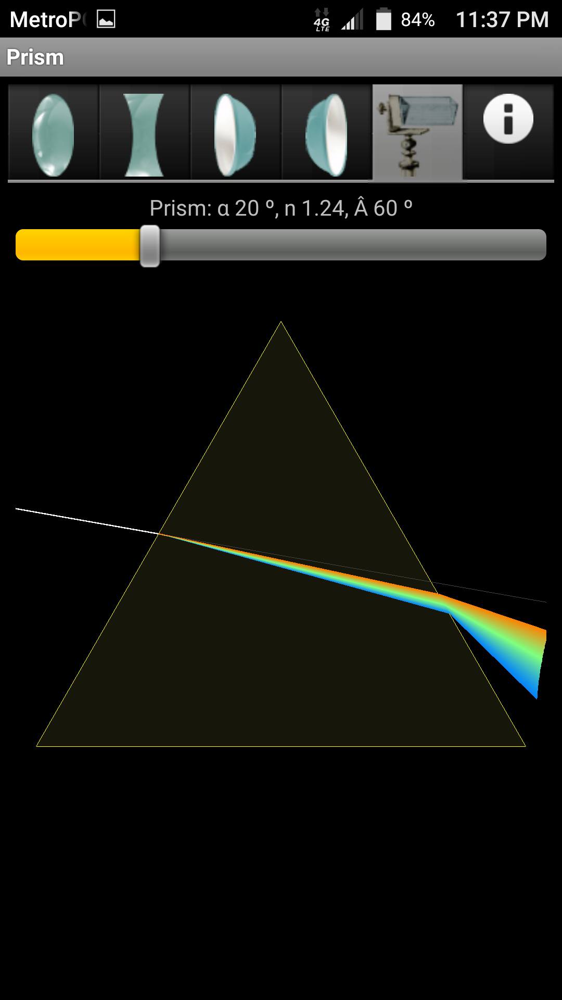
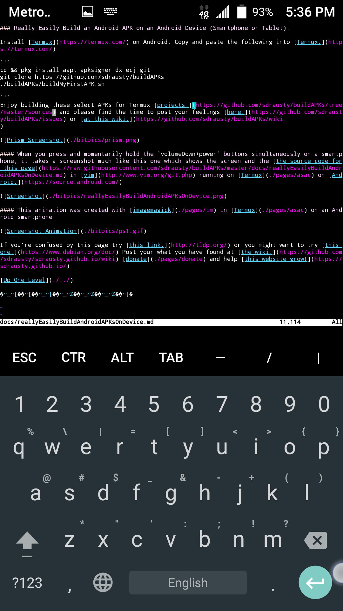

### Really Easily Build an Android APK on an Android Device (Smartphone or Tablet).

Contributors:
[@fornwall](https://github.com/fornwall)
[@vishalbiswas](https://github.com/vishalbiswas)
https://github.com/TheDiamondYT1

Please contribute to this project through either [the issues page](https://github.com/sdrausty/buildAPKs/issues) or [pull requests.](https://github.com/sdrausty/buildAPKs/pulls) Now you don't need Google Play, f-droid or others to enjoy wonderfully working APKs on your smartphone and tablet thanks to [Termux](./pages/asac) on [Android](https://source.android.com/) and [Github.](https://github.com)

Enjoy building these select APKs for Termux [projects,](https://github.com/sdrausty/buildAPKs/tree/master/sources) and please find the time to post your feelings [here,](https://github.com/sdrausty/buildAPKs/issues) or [at this wiki.](https://github.com/sdrausty/buildAPKs/wiki
)

#### When you press and momentarily hold the `volumeDown+power` buttons simultaneously on a smartphone, it takes a screenshot much like this one which shows the screen and the [the source code for this page](https://raw.githubusercontent.com/sdrausty/buildAPKs/master/docs/reallyEasilyBuildAndroidAPKsOnDevice.md) in [vim](http://www.vim.org/git.php) running on [Termux](./pages/asac) on [Android.](https://source.android.com/)

#### This animation was created with [imagemagick](https://sdrausty.github.io/pages/im.html) in [Termux](https://sdrausty.github.io/pages/asac.html) on an Android smartphone.

If you're confused by this page try [this link,](http://tldp.org/) or you might want to try [this one.](https://www.debian.org/doc/) Post your what you have found at [the wiki,](https://github.com/sdrausty/buildAPKs/wiki) [donate](https://sdrausty.github.io/pages/donate) and help [this website grow!](https://sdrausty.github.io/)

[Up One Level](./../)

🛳⛴🛥🚢🚤🚣⛵

