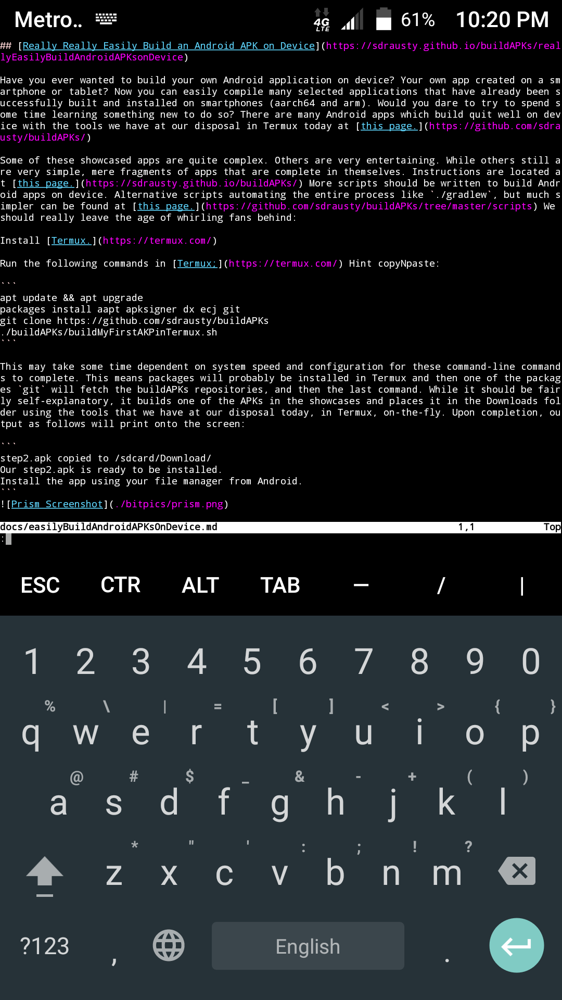

## [Really Easily Build an Android APK on Device](https://sdrausty.github.io/buildAPKs/reallyEasilyBuildAndroidAPKsOnDevice)

Have you ever wanted to build your own Android application on device? Your own app created on a smartphone or tablet? Now you can easily compile many selected applications that have already been successfully built and installed on smartphones (aarch64 and arm). Would you dare to try to spend some time learning something new to do so? There are many Android apps which build quit well on device with the tools we have at our disposal in [Termux.](https://termux.com/) today at [this page.](https://github.com/sdrausty/buildAPKs/)

Some of these showcased apps are quite complex. Others are very entertaining. While others still are very simple, mere fragments of apps that are complete in themselves. Instructions are located at [this page.](https://sdrausty.github.io/buildAPKs/) More scripts should be written to build Android apps on device. Alternative scripts automating the entire process like `./gradlew`, but much simpler can be found at [this page.](https://github.com/sdrausty/buildAPKs/tree/master/scripts/build/) We should really leave the age of whirling fans and disk drives behind:  

Install [Termux.](https://termux.com/)

Run the following commands in [Termux;](https://termux.com/) Hint copyNpaste:

```
cd && apt update && apt upgrade
packages install aapt apksigner dx ecj git 
git clone https://github.com/sdrausty/buildAPKs
./buildAPKs/scripts/build/buildMyFirstAPK.sh

``` 

This may take some time dependent on system speed and configuration for these command-line commands to complete. This means packages will probably be installed in [Termux.](https://termux.com/) and then one of the packages, `git` will fetch the buildAPKs repositories, and then the last command. While it should be fairly self-explanatory, it builds one of the APKs in the showcases and places it in the Downloads folder using the tools that we have at our disposal today, in [Termux,](https://termux.com/) on-the-fly. Upon completion, output as follows will print onto the screen:

```
step2.apk copied to /sdcard/Download/                          
Our step2.apk is ready to be installed.                        
Install the app using your file manager from Android.
```


Enjoy this project! Your feedback is welcome at the wiki for this showcase of open source APKs at [this wiki.](https://github.com/sdrausty/buildAPKs/wiki) The wiki for [sdrausty.github.io](https://sdrausty.github.io/) is located at [this wiki.](https://github.com/sdrausty/sdrausty.github.io/wiki) Please do not confuse the two different wikies. You are invited to contribute to the /docs directory as well, which is home to this [webpage directory,](https://sdrausty.github.io/buildAPKs/) as well as this page you are reading now. So in a way you are reading a defacto wiki page. 

An issue page is located at [here](https://github.com/sdrausty/buildAPKs/issues) and please remember about the fascinating git coding processes of cloning and merging source code on GitHub. Have fun! Enjoy!

#### When you press and momentarily hold the `volumeDown+power` buttons simultaneously on a smartphone, it takes a screenshot much like this one which shows the screen and the [the source code for this page](https://raw.githubusercontent.com/sdrausty/buildAPKs/master/docs/easilyBuildAndroidAPKsOnDevice.md) in [vim](http://www.vim.org/git.php) running on [Termux](./pages/asac) on [Android.](https://source.android.com/)



#### This animation was created with [imagemagick](https://sdrausty.github.io/pages/im.html) in [Termux](https://sdrausty.github.io/pages/asac.html) on an Android smartphone.


If you're confused by this page try [this link,](http://tldp.org/) or you might want to try [this one.](https://www.debian.org/doc/) Post your what you have found at [the wiki,](https://github.com/sdrausty/buildAPKs/wiki) [donate](https://sdrausty.github.io/pages/donate) and help [this website grow!](https://sdrausty.github.io/)

[Up One Level](./../)

🛳⛴🛥🚢🚤🚣⛵

