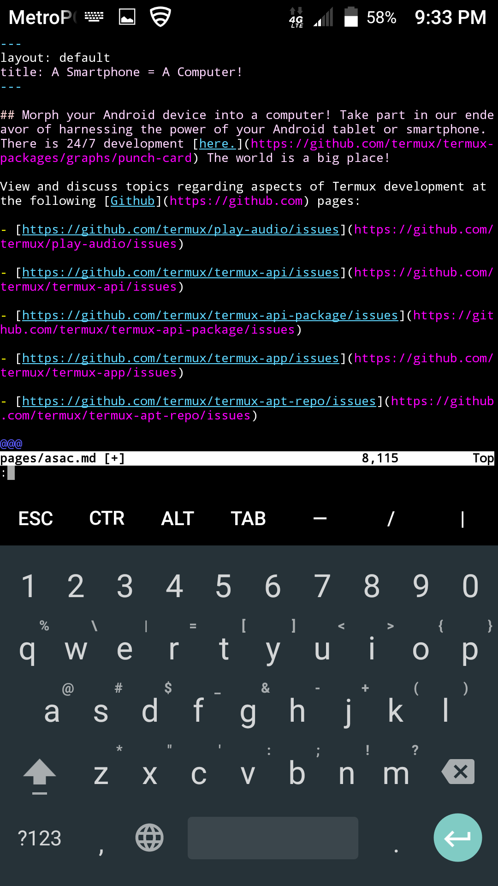

## Morph your Android device into a computer! Take part in our endeavor of harnessing the power of your Android tablet or smartphone. There is 24/7 development [here.](https://github.com/termux/termux-packages/graphs/punch-card) The world is a big place!

View and discuss topics regarding aspects of Termux development at the following [Github](https://github.com) pages:

- [https://github.com/termux/play-audio/issues](https://github.com/termux/play-audio/issues)

- [https://github.com/termux/termux-api/issues](https://github.com/termux/termux-api/issues)

- [https://github.com/termux/termux-api-package/issues](https://github.com/termux/termux-api-package/issues)

- [https://github.com/termux/termux-app/issues](https://github.com/termux/termux-app/issues)

- [https://github.com/termux/termux-apt-repo/issues](https://github.com/termux/termux-apt-repo/issues)

- [https://github.com/termux/termux-create-package/issues](https://github.com/termux/termux-create-package/issues)

- [https://github.com/termux/termux-packages/issues](https://github.com/termux/termux-packages/issues)

### When you press the `volumeDown+power` buttons simultaneously on a smartphone, it takes a screenshot like this one of [the source code for this page](https://raw.githubusercontent.com/sdrausty/sdrausty.github.io/master/pages/asac.md) in [vim](http://www.vim.org/git.php) running in [Termux](./asac.md) on [Android.](https://source.android.com/)

#### This animation was created with [imagemagick](https://sdrausty.github.io/pages/im.html) in [Termux](https://sdrausty.github.io/pages/asac.html) on an Android smartphone.

If you're confused by this page try [this link,](http://tldp.org/) or you might want to try [this one.](https://www.debian.org/doc/) Post your what you have found at [the wiki for this website](https://github.com/sdrausty/sdrausty.github.io/wiki) and [donate](./donate.md) to let [sdrausty.github.io](https://sdrausty.github.io/) grow.

- [Termux for Android!](https://termux.com/)

- [Termux on F-droid!](https://f-droid.org/packages/com.termux/) Please do not mix your installation of Termux between Google Play and F-droid. There are [compatibility issues.](https://github.com/termux/termux-api/issues/53)
https://f-droid.org/packages/com.termux/

[Back to the Previous Page](./../)
